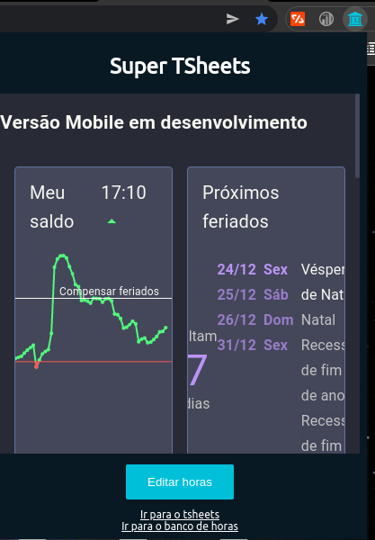

# Chrome Extension - Super TSheets

Extensão desenvolvida para adicionar ao TSheets web os horários em que o dia será completo, além de disponibilizar o card de clock-in/out ao painel do chrome.

## Partes adicionadas 

### Completion Time (day)
Hora do dia em que você terminará as horas necessárias para o dia (por padrão 8h)

### Completion Time (week)
Hora do dia em que você terminará as horas necessárias para a semana (5 vezes a quantidade de horas por dia)

## Painel da extensão

### Para alterar a quantidade de horas padrão:

1. Primeiro, pressione o botão "Editar horas"
   

1. Aparecerá uma caixa de texto com a quantidade de horas padrão. Basta editar e apertar "Atualizar"

